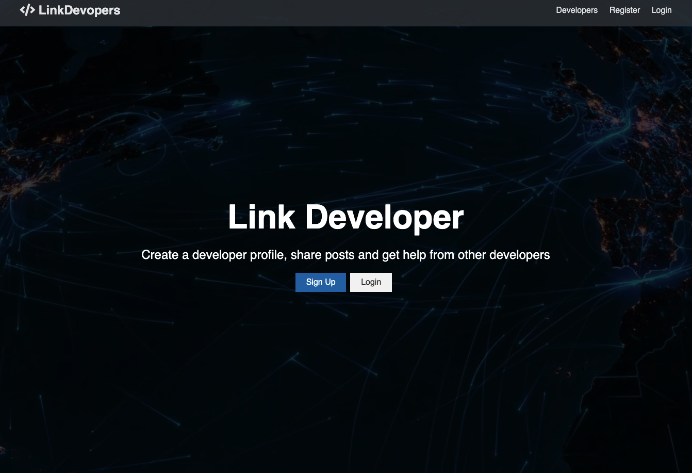
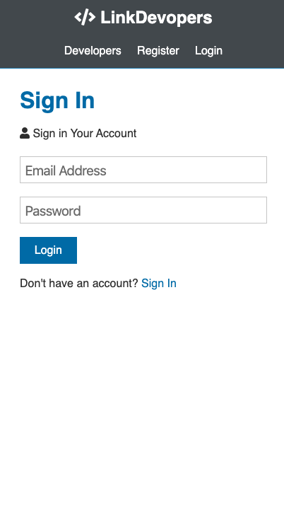
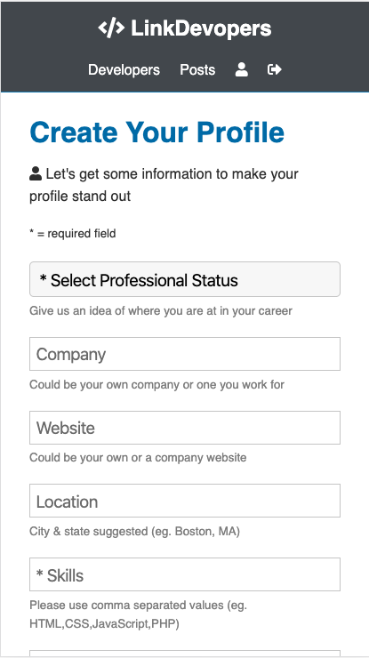
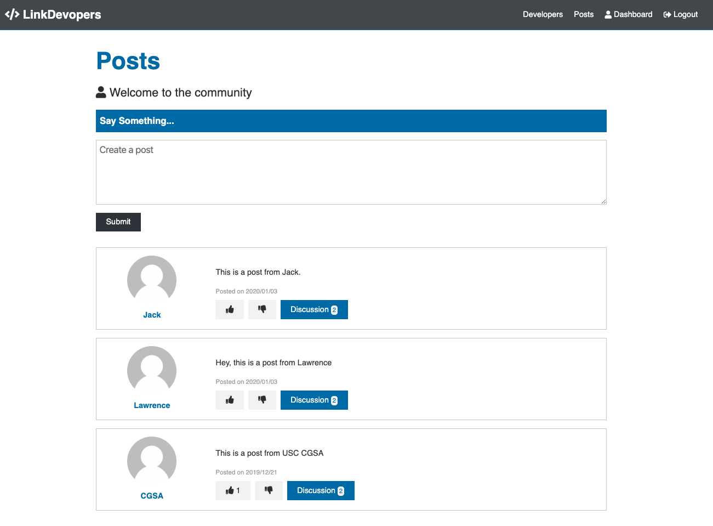
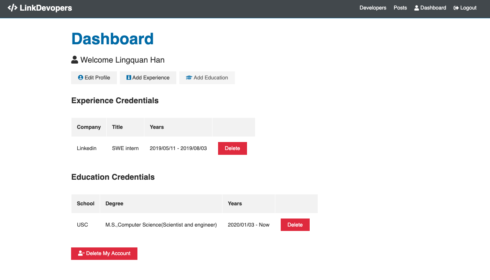
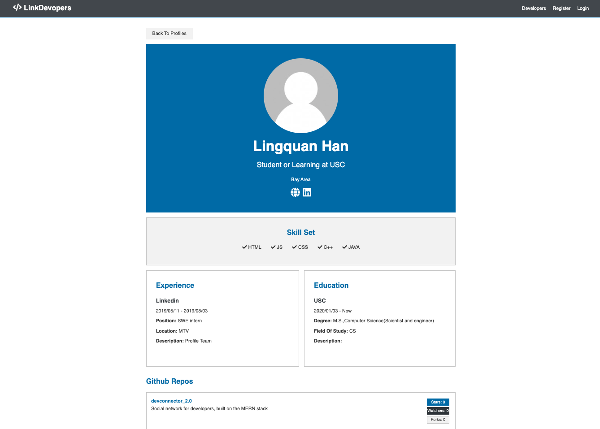
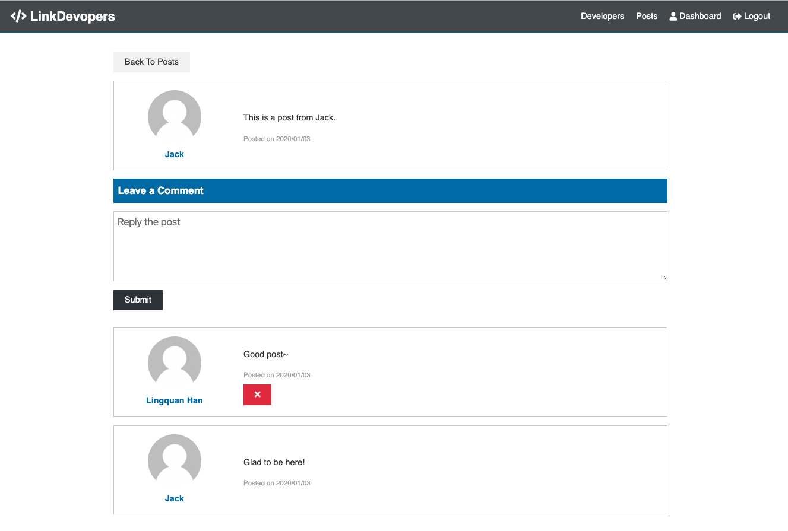
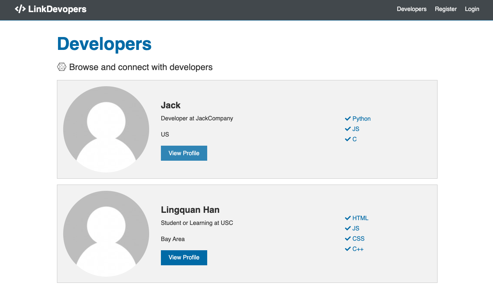

# Link Developer Fullstack Web Application

## 1.High-level Discription

The project is a fullstack application of social network. MERN(Node.js, Express, React, Redux and MongoDB) stack is used to implement the app. Developers can register their own accounts, create their own profile and interat with other developer on the forum. A few to-do are waiting for implementation.

## 2. What did in this project

- Build an extensive backend API with Node.js & Express

- Protect routes/endpoints with JWT (JSON Web Tokens)

- Extensive API testing with Postman

- Integrate React with our backend in an elegant way, creating a great workflow

- Build frontend to work with the API

- Use Redux for app state management

- Create reducers and actions for our resources

- Create many container components that integrate with Redux

- Test with the Redux Chrome extension

- Create a build script, securing our keys and deploy to Heroku using Git

- Use React Hooks, Async/Await

## 3. App Screenshot

    
 
 
 
 
 
 
 
 
 

## 4. To-do

- Allow user to modify Avatar
- Add job post functionality
- Add search functionality
- Add message fucntionality

### Source of Project

[Root project from Bradtraversy](https://github.com/bradtraversy/devconnector_2.0)
